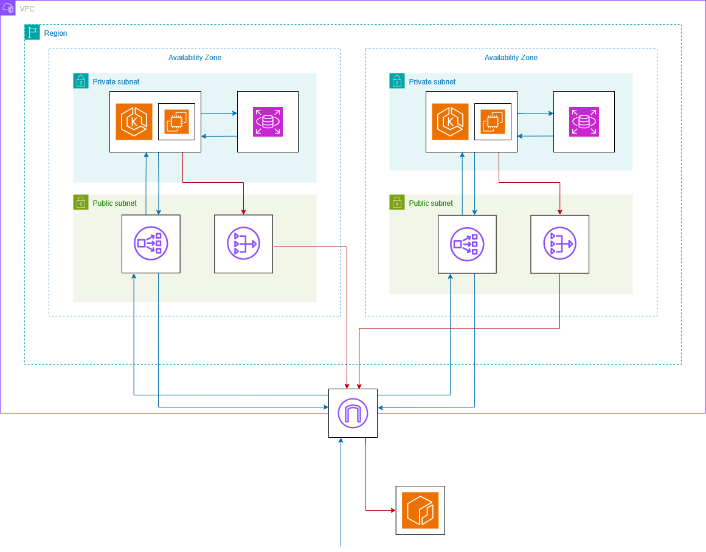
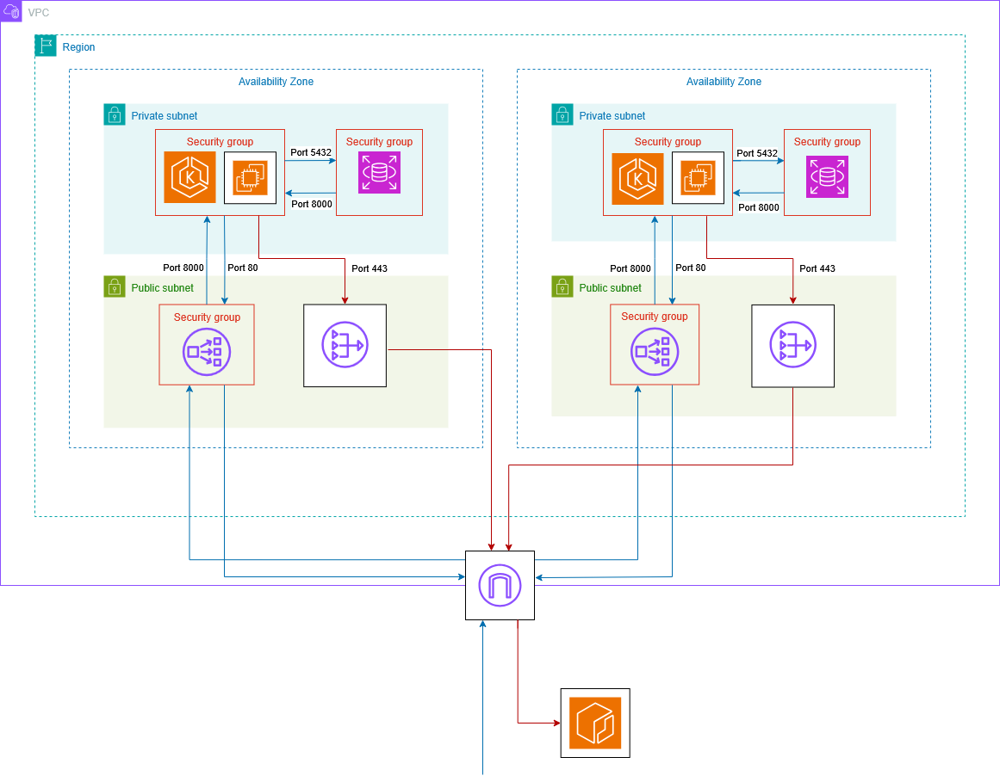

# FitTech - Kubernetes Migration

## Description
This repository does the Kubernetes migration for another repository in my account, called FitTech, in which I document the REST API, Docker containerization, Terraform infrastructure code and AWS architecture, and CI/CD pipeline in detail. That's why in this repository I will only document only the changes, which include the kubernetes/ folder, the Terraform infrastructure code, AWS architecture and the CI/CD pipeline.

The kubernetes folder/ will have its own README while the rest of changes will be documented in this README.

## Changes

### AWS Architecture and Terraform infrastructure code
Instead of using an ECS cluster, the architecture now has an EKS (Elastic Kubernetes Service cluster) cluster, with an EKS managed node group using EC2 instances, which is simpler than Fargate.

The reason why EC2 instances were better in my situation to Fargate is because with EC2 instances, AWS creates and manages an ELB (Elastic Load Balancer), shown in the diagram below as a NLB (Network Load Balancer) which routes traffic to statis node IPs, while kube-proxy manages the routing internally to the pod IPs, which are dynamic because they change each time the pods are restarted. With Fargate, there is no need for kube-proxy because the NLB routes traffic directly to the dynamic pod IPs, which forces the NLB to know which pods IPs are functional, and it takes time since it has to run health checks in each pod, causing a delay that ended up with the application failing at start, which makes me have to install an ALB controller and create a service account for it, when the EC2 instance approach has less overhead.

The following diagram is the new AWS architecture.

In the Terraform code, I deleted the ALB listener, target groups and service since they were not needed anymore, because the Kubernetes service managed the routing instead, and AWS automatically creates an ELB for that service.

The app functions the same way as before, but now it allows me to use a microservices architecture, which allows me to add a Redis cache in the same pod as the app container to have low latency and a more robust app.

And the following diagram shows the networking between the elements of the architecture.

### CI/CD pipeline
Now, instead of providing the production secrets to Terraform so that it gets passed to the container directly, the Terraform only creates an EKS cluster, and I have to use Helm as a package manager that provides the Kubernetes manifests templated and packaged to the EKS cluster.

Helm by itself isn't a package manager in the formal sense, like npm or pip. What it does is that it allows me to have Kubernetes manifests that use dynamic variables, which lets me automate deployment and protect secrets with ease, by using values.yaml, which works as an .env file and can receive variables from outside. And by receving variables from outside, it lets me to provide secrets in production safely and Helm makes sure it sends to the EKS cluster updated Kubernetes manifests and packages them into a chart, which allows me to manage multiple version of the chart, so if a chart failed because there was a small error in one of the Kubernetes manifests, I can rollback on the chart version and use a correct one.

Also, I install kubectl and configure kubeconfig authenticating with AWS so that there is a connection between the machine and the Kubernetes API, and from this API to the AWS EKS cluster, which allows Helm to send the chart to the EKS cluster.

In the deployment rollout steps, I wait for the pod to be ready, and since I had a hard time debugging why the pod wouldn't start even though there was 2 worker nodes available, I added logs to get the container logs, which helped me identify multiple issues that I didn't think about, like the specific format to use in the database URL and some container errors.

Finally, instead of getting the API URL from Terraform ALB as I did with ECS, I get it from Kubernetes API since now the traffic routing to the pods is controlled by the Kubernetes service, which uses an already created AWS ELB, which I use to run a health check to port 80, which successfully worked the last time I run the pipeline.